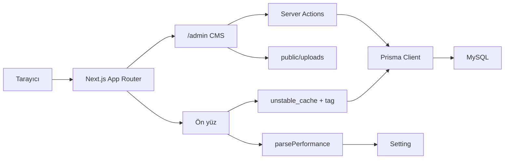

# İhsan Akyıldız — Kurumsal Portal

Next.js 15 tabanlı web tasarım ve yazılım stüdyosu sitesi. **Admin CMS** ve **ön yüz** birlikte çalışır; içerik Prisma üzerinden yayınlanır, ziyaretçi sayfaları admin’deki Performans ayarlarına göre hızlandırılır.

[](https://nextjs.org/)
[](https://www.typescriptlang.org/)
[](https://www.prisma.io/)
[](https://tailwindcss.com/)

---

## Özellikler

- Velzon tarzı admin arayüz (sidebar, header, kartlar)
- Aydınlık / karanlık tema (tercih tarayıcıda saklanır)
- Dashboard: gerçek içerik sayıları, kategori yoğunluğu, son güncellemeler
- Klasik ve gelişmiş sayfalar (SEO, görsel, ilişkili iş / proje / blog, bölüm builder)
- Hero slaytları (görünüm, metin, medya, önizleme)
- Kartlar (görsel veya Lucide ikon)
- SSS grupları ve soru-cevap (modal CRUD)
- Fiyatlandırma paketleri
- Mega menü: CMS içeriği veya özel link, iç içe öğeler, sürükle-bırak
- Yapılan işler, projeler ve blog — sınırsız alt kategori + ön yüz kategori sayfaları
- Proje vitrini: müşteri, özellik, galeri, metrik
- TipTap zengin metin editörü (görsel yükleme ve kırpma)
- Dil / çeviri kayıtları ve genel site ayarları
- Performans ayarları (CDN, lazy load, HTML cache, analitik gecikmesi) — ön yüze uygulanır
- Admin listelerinde “Sitede aç” (yeni sekmede ön yüz URL’si)

---

## Teknoloji yığını

| Katman | Seçim |
| --- | --- |
| Framework | Next.js 15 (App Router), React 19 |
| Dil | TypeScript |
| Stil | Tailwind CSS 4 |
| Veritabanı | MySQL / MariaDB (XAMPP) |
| ORM | Prisma 6 |
| Auth | Auth.js (next-auth v5) — JWT + Credentials |
| Editör | TipTap |
| Sıralama | @dnd-kit (menü ağacı) |
| i18n | `messages/*.json` + veritabanı `Translation` |
| Görsel | Sharp (WebP dönüşümü), react-easy-crop |

---

## Mimari



- **Admin paneli** `src/app/admin` altında. `(auth)` login, `(panel)` korumalı yönetim.
- **Middleware** yalnızca `/admin/*` yollarını oturuma bağlar; admin isteklerine `x-pathname` ekler.
- **İçerik** Prisma modellerinde; grup + öğe kalıbı SSS ve menülerde tekrarlanır.
- **Ön yüz** `src/app/(site)` altında; listeler `src/lib` cache helper’ları ile çekilir.
- **Performans** admin `/admin/settings/performance` kayıtları `parsePerformance` ile ön yüze yansır.

---

## Proje yapısı

```text
├── messages/                 # next-intl JSON çevirileri (tr, en)
├── prisma/
│   ├── schema.prisma         # veri modeli
│   ├── seed.ts               # admin kullanıcı, diller, örnek içerik
│   └── migrations/           # SQL migrasyonları
├── public/uploads/           # yüklenen görseller (.gitkeep hariç ignore)
└── src/
    ├── app/
    │   ├── (site)/           # anasayfa, blog, projeler, yapılan işler, sayfalar
    │   ├── admin/(auth)/     # /admin/login
    │   ├── admin/(panel)/    # dashboard ve tüm CMS modülleri
    │   └── api/              # Auth.js + editör görsel yükleme
    ├── components/
    │   ├── admin/            # shell, tema, editör, dashboard
    │   └── site/             # SiteImage, SiteLink, kartlar, sidebar
    ├── config/               # admin menü, ayar alan tanımları
    ├── lib/                  # prisma, performans, cache, slug, seo, URL’ler
    ├── auth.ts               # Auth.js yapılandırması
    └── middleware.ts
```

---

## Ön yüz rotaları

| İçerik | Liste | Kategori dizini | Kategori | Detay |
| --- | --- | --- | --- | --- |
| Blog | `/blog` | `/blog/kategori` | `/blog/kategori/{slug}` | `/blog/{slug}` |
| Yapılan işler | `/yapilan-isler` | `/yapilan-isler/kategori` | `/yapilan-isler/kategori/{slug}` | `/yapilan-isler/{slug}` |
| Projeler | `/projeler` | `/projeler/kategori` | `/projeler/kategori/{slug}` | `/projeler/{slug}` |
| CMS sayfa | — | — | — | `/{slug}` (`anasayfa` → `/`) |

Kategori sayfalarında sol sidebar, alt kategorilerdeki kayıtlar üst kategoride toplanır, 9’lu sayfalama (`?sayfa=`) kullanılır. Menüdeki “blog / iş / proje kategorisi” linkleri bu kategori URL’lerine çözülür.

Admin listelerinde başlık, URL ve dış link ikonu aynı adresi yeni sekmede açar.

---

## Performans

Admin **Ayarlar → Performans** (`/admin/settings/performance`) kayıtları ziyaretçi sayfalarına uygulanır. Kod: `src/lib/performance.ts`, `SiteImage`, `SiteLink`, `PerformanceHead`, `DeferredAnalytics`, `prepareRichHtml`.

### Ön yüz (ziyaretçi)

| Ayar | Etki |
| --- | --- |
| CDN URL | Kapak, kart ve galeri görselleri `withCdnUrl` ile CDN üzerinden |
| Lazy görseller / iframe | Zengin metinde `loading="lazy"`; LCP kapakları `priority` + `preload` |
| Üçüncü parti kapat | Paylaşım / sosyal butonlar ve analitik yüklenmez; HTML’den üçüncü parti iframe temizlenir |
| Prefetch | `SiteLink` iç gezinmede Next.js prefetch (ayar açıksa) |
| Görsel kalite / WebP / responsive | `SiteImage` Next Image `quality`, `sizes`, WebP önceliği |
| HTML cache (saniye) + SWR | `revalidate = 60` ve `unstable_cache` etiketleri (`works`, `projects`, `blog`, `site`) |
| Analitik gecikmesi | GA / GTM `DeferredAnalytics` ile idle veya gecikmeli yükleme |
| Font display swap | Kök layout’ta `display: swap` |
| Logo preload | `PerformanceHead` ile LCP logosu |

İçerik güncellenince ilgili `revalidateTag` / `revalidatePath` (liste + kategori + detay) çalışır.

### Admin paneli

Yönetim ekranları her istekte site ayarlarını ve LongText içerikleri çekmesin diye ayrı hızlandırıldı:

- Admin isteklerinde kök layout **site ayarları, analitik ve PerformanceHead atlanır**
- Liste sorguları yalnızca tabloda gereken alanları `select` eder (`content` çekilmez)
- Dashboard `groupBy` ile daha az COUNT sorgusu
- TipTap editör form açılınca yüklenir (`dynamic`, `ssr: false`)
- `lucide-react` `optimizePackageImports`
- Prisma bağlantı havuzu: `connection_limit=8`, `pool_timeout=20`
- Oturum `React.cache` ile layout + dashboard’da tek JWT okuması
- Gezinmede tam ekran overlay yok; yalnızca üst ilerleme çubuğu + iskelet `loading.tsx`

### Cache notları

- Ön yüz HTML: sayfa `revalidate = 60`
- Ayarlar: `getSettingsMap` tag `settings`, 60 sn
- `next.config.ts`: `/uploads` uzun `Cache-Control`; isteğe bağlı `PERF_HTML_CACHE_SECONDS` ortam değişkeni
- Cache paneli: `/admin/settings/performance` üzerinden güvenli revalidate

---

## Admin modülleri

| Modül | Rota | Ne işe yarar |
| --- | --- | --- |
| Dashboard | `/admin` | İçerik özeti ve hızlı oluşturma |
| Sayfalar | `/admin/pages` | Klasik CMS ve gelişmiş builder |
| Hero | `/admin/heroes` | Slayt koleksiyonları |
| Kartlar | `/admin/cards` | Hizmet / özellik kartları |
| Fiyatlandırma | `/admin/pricing` | Paketler |
| SSS | `/admin/faqs` | Sayfa bazlı soru grupları |
| Menüler | `/admin/menus` | Header / footer / mega menü |
| Yapılan işler | `/admin/works` | Kategori + çalışma |
| Projeler | `/admin/projects` | Kategori, müşteri, özellik, proje |
| Blog | `/admin/blog` | Kategori + yazı |
| Ayarlar | `/admin/settings` | Genel, performans, dil, çeviri |

Menü öğeleri şu içeriklere bağlanabilir: özel URL, sayfa, iş kategorisi / çalışma, proje kategorisi / proje, blog kategorisi / yazı. Alt menü için sürükleyip başka öğenin üzerine bırakın.

---

## Veri modeli (özet)

- **User** — admin hesabı (bcrypt şifre)
- **Language / Translation / Setting** — dil, çeviri, site ayarları
- **WorkCategory / Work** — hizmet ağacı ve içerikler
- **ProjectCategory / Project / ProjectClient / ProjectFeature** — portföy
- **BlogCategory / BlogPost** — blog
- **Page / PageSection** — klasik veya gelişmiş sayfa
- **Hero / HeroSlide / HeroSlideMedia** — vitrin slaytları
- **Card** — görsel veya ikon kart
- **FaqGroup / FaqItem** — SSS
- **PricingPlan** — fiyat paketleri
- **MenuGroup / MenuItem** — iç içe menü (`parentId`)

---

## Kurulum

### Gereksinimler

- Node.js 20+
- XAMPP (Apache + MySQL) veya eşdeğer MySQL 8 / MariaDB

### 1. Veritabanı

phpMyAdmin’de `ihsanakyildiz` adında bir veritabanı oluşturun. Karakter seti: `utf8mb4`, karşılaştırma: `utf8mb4_general_ci`.

### 2. Bağımlılıklar

```bash
npm install
```

### 3. Ortam değişkenleri

Proje kökünde `.env` dosyası oluşturun:

```env
DATABASE_URL="mysql://root:@127.0.0.1:3306/ihsanakyildiz"
AUTH_SECRET="en-az-32-karakter-rastgele-bir-anahtar"
AUTH_URL="http://localhost:3000"

ADMIN_EMAIL="ihsanakyildiz@gmail.com"
ADMIN_PASSWORD="*******"
ADMIN_NAME="Admin"
```

`AUTH_SECRET` üretimde mutlaka değiştirin. Admin bilgileri yalnızca `npm run db:seed` sırasında kullanılır.

İsteğe bağlı (ön yüz HTTP cache başlığı):

```env
PERF_HTML_CACHE_SECONDS="60"
PERF_ASSET_CACHE_DAYS="365"
PERF_STALE_WHILE_REVALIDATE="true"
```

### 4. Şema ve örnek veri

```bash
npm run db:generate
npm run db:push
npm run db:seed
```

Migrasyon geçmişini kullanmak isterseniz `db:push` yerine:

```bash
npm run db:migrate
```

Seed örnekleri: Header / Footer menü, Anasayfa SSS, Hizmetler SSS.

### 5. Geliştirme sunucusu

```bash
npm run dev
```

- Site: [http://localhost:3000](http://localhost:3000)
- Admin: [http://localhost:3000/admin/login](http://localhost:3000/admin/login)

`next.config` veya `middleware` değişince geliştirme sunucusunu yeniden başlatın.

---

## npm komutları

| Komut | Açıklama |
| --- | --- |
| `npm run dev` | Geliştirme sunucusu |
| `npm run build` | Üretim derlemesi |
| `npm run start` | Derlenmiş uygulamayı çalıştır |
| `npm run lint` | ESLint |
| `npm run db:generate` | Prisma Client üret |
| `npm run db:migrate` | Migrasyon (etkileşimli) |
| `npm run db:push` | Şemayı veritabanına yansıt |
| `npm run db:seed` | Örnek / admin verisi |
| `npm run db:studio` | Prisma Studio |

---

## Ön yüz entegrasyonu

Admin’de üretilen içerik slug ve cache helper’ları ile çekilir. Örnek:

```ts
import { getMenuBySlug } from "@/lib/menus";
import { getFaqGroupBySlug } from "@/lib/faqs";
import { getHeroBySlug } from "@/lib/heroes";
import { parsePerformance } from "@/lib/performance";
import { getSettingsMap } from "@/lib/settings";

const header = await getMenuBySlug("header-menu");
const faq = await getFaqGroupBySlug("anasayfa-sss");
const hero = await getHeroBySlug("anasayfa-hero");
const perf = parsePerformance(await getSettingsMap());
```

Liste / kategori cache: `getCachedBlogListing`, `getCachedWorkCategoryPage`, `getCachedProjectCategoryIndex` (`src/lib/blog.ts`, `works.ts`, `projects.ts`).

Yüklenen dosyalar `public/uploads` altındadır ve uzun süre cache’lenir.

---

## Notlar

- `.env` ve `public/uploads/**` git’e eklenmez.
- Windows’ta Prisma `EPERM` verirse çalışan `node` süreçlerini kapatıp `npm run db:generate` tekrarlayın.
- Pasif içeriklerin admin’deki “Sitede aç” linki 404 verebilir; ön yüz yalnızca aktif kayıtları yayınlar.
