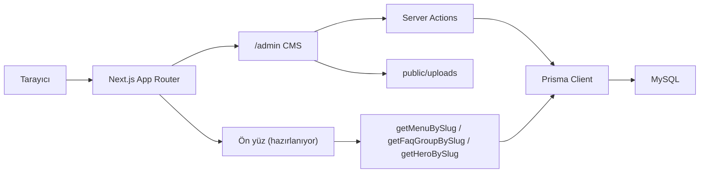

# İhsan Akyıldız — Kurumsal Portal

Next.js 15 tabanlı web tasarım ve yazılım stüdyosu sitesi. Şu an **admin CMS** tamamlanmış durumda; ziyaretçi yüzü (frontend) içerik API’leri üzerinden kademeli olarak bağlanacak.

[](https://nextjs.org/)
[](https://www.typescriptlang.org/)
[](https://www.prisma.io/)
[](https://tailwindcss.com/)

---

## Özellikler

- Velzon tarzı admin arayüz (sidebar, header, kartlar)
- Aydınlık / karanlık tema (tercih tarayıcıda saklanır)
- Dashboard: gerçek içerik sayıları, kategori yoğunluğu, son güncellemeler
- Klasik sayfalar (SEO, görsel, ilişkili iş / proje / blog)
- Hero slaytları (görünüm, metin, medya, önizleme)
- Kartlar (görsel veya Lucide ikon)
- SSS grupları ve soru-cevap (modal CRUD)
- Mega menü: CMS içeriği veya özel link, iç içe öğeler, sürükle-bırak
- Yapılan işler, projeler ve blog — sınırsız alt kategori
- Proje vitrini: müşteri, özellik, galeri, metrik
- TipTap zengin metin editörü (görsel yükleme ve kırpma)
- Dil / çeviri kayıtları ve genel site ayarları
- Performans ayarları (cache, lazy load, analitik gecikmesi)

---

## Teknoloji yığını

| Katman | Seçim |
| --- | --- |
| Framework | Next.js 15 (App Router), React 19 |
| Dil | TypeScript |
| Stil | Tailwind CSS 4 |
| Veritabanı | MySQL / MariaDB (XAMPP) |
| ORM | Prisma 6 |
| Auth | Auth.js (next-auth v5) — JWT + Credentials |
| Editör | TipTap |
| Sıralama | @dnd-kit (menü ağacı) |
| i18n | `messages/*.json` + veritabanı `Translation` |
| Görsel | Sharp (WebP dönüşümü), react-easy-crop |

---

## Mimari



- **Admin paneli** `src/app/admin` altında. `(auth)` login, `(panel)` korumalı yönetim.
- **Middleware** yalnızca `/admin/*` yollarını oturuma bağlar.
- **İçerik** Prisma modellerinde; grup + öğe kalıbı SSS ve menülerde tekrarlanır.
- **Ön yüz helper’ları** `src/lib` içinde slug ile veri çeker (`header-menu`, `anasayfa-sss`, `anasayfa-hero`).

---

## Proje yapısı

```text
├── messages/                 # next-intl JSON çevirileri (tr, en)
├── prisma/
│   ├── schema.prisma         # veri modeli
│   ├── seed.ts               # admin kullanıcı, diller, örnek içerik
│   └── migrations/           # SQL migrasyonları
├── public/uploads/           # yüklenen görseller (.gitkeep hariç ignore)
└── src/
    ├── app/
    │   ├── admin/(auth)/     # /admin/login
    │   ├── admin/(panel)/    # dashboard ve tüm CMS modülleri
    │   └── api/              # Auth.js + editör görsel yükleme
    ├── components/admin/     # shell, tema, editör, dashboard
    ├── config/               # admin menü, ayar alan tanımları
    ├── lib/                  # prisma, slug, seo, menü/sss/hero helper
    ├── auth.ts               # Auth.js yapılandırması
    └── middleware.ts
```

---

## Admin modülleri

| Modül | Rota | Ne işe yarar |
| --- | --- | --- |
| Dashboard | `/admin` | İçerik özeti ve hızlı oluşturma |
| Sayfalar | `/admin/pages` | Klasik CMS sayfaları |
| Hero | `/admin/heroes` | Slayt koleksiyonları |
| Kartlar | `/admin/cards` | Hizmet / özellik kartları |
| SSS | `/admin/faqs` | Sayfa bazlı soru grupları |
| Menüler | `/admin/menus` | Header / footer / mega menü |
| Yapılan işler | `/admin/works` | Kategori + çalışma |
| Projeler | `/admin/projects` | Kategori, müşteri, özellik, proje |
| Blog | `/admin/blog` | Kategori + yazı |
| Ayarlar | `/admin/settings` | Genel, performans, dil, çeviri |

Menü öğeleri şu içeriklere bağlanabilir: özel URL, sayfa, iş kategorisi / çalışma, proje kategorisi / proje, blog kategorisi / yazı. Alt menü için sürükleyip başka öğenin üzerine bırakın.

---

## Veri modeli (özet)

- **User** — admin hesabı (bcrypt şifre)
- **Language / Translation / Setting** — dil, çeviri, site ayarları
- **WorkCategory / Work** — hizmet ağacı ve içerikler
- **ProjectCategory / Project / ProjectClient / ProjectFeature** — portföy
- **BlogCategory / BlogPost** — blog
- **Page** — klasik sayfa + iş / proje / yazı ilişkileri
- **Hero / HeroSlide / HeroSlideMedia** — vitrin slaytları
- **Card** — görsel veya ikon kart
- **FaqGroup / FaqItem** — SSS
- **MenuGroup / MenuItem** — iç içe menü (`parentId`)

---

## Kurulum

### Gereksinimler

- Node.js 20+
- XAMPP (Apache + MySQL) veya eşdeğer MySQL 8 / MariaDB

### 1. Veritabanı

phpMyAdmin’de `ihsanakyildiz` adında bir veritabanı oluşturun. Karakter seti: `utf8mb4`, karşılaştırma: `utf8mb4_general_ci`.

### 2. Bağımlılıklar

```bash
npm install
```

### 3. Ortam değişkenleri

Proje kökünde `.env` dosyası oluşturun:

```env
DATABASE_URL="mysql://root:@127.0.0.1:3306/ihsanakyildiz"
AUTH_SECRET="en-az-32-karakter-rastgele-bir-anahtar"
AUTH_URL="http://localhost:3000"

ADMIN_EMAIL="ihsanakyildiz@gmail.com"
ADMIN_PASSWORD="*******"
ADMIN_NAME="Admin"
```

`AUTH_SECRET` üretimde mutlaka değiştirin. Admin bilgileri yalnızca `npm run db:seed` sırasında kullanılır.

### 4. Şema ve örnek veri

```bash
npm run db:generate
npm run db:push
npm run db:seed
```

Migrasyon geçmişini kullanmak isterseniz `db:push` yerine:

```bash
npm run db:migrate
```

Seed örnekleri: Header / Footer menü, Anasayfa SSS, Hizmetler SSS.

### 5. Geliştirme sunucusu

```bash
npm run dev
```

- Site: [http://localhost:3000](http://localhost:3000)
- Admin: [http://localhost:3000/admin/login](http://localhost:3000/admin/login)

---

## npm komutları

| Komut | Açıklama |
| --- | --- |
| `npm run dev` | Geliştirme sunucusu |
| `npm run build` | Üretim derlemesi |
| `npm run start` | Derlenmiş uygulamayı çalıştır |
| `npm run lint` | ESLint |
| `npm run db:generate` | Prisma Client üret |
| `npm run db:migrate` | Migrasyon (etkileşimli) |
| `npm run db:push` | Şemayı veritabanına yansıt |
| `npm run db:seed` | Örnek / admin verisi |
| `npm run db:studio` | Prisma Studio |

---

## Ön yüz entegrasyonu

Admin’de üretilen içerik slug ile çekilir. Örnek:

```ts
import { getMenuBySlug } from "@/lib/menus";
import { getFaqGroupBySlug } from "@/lib/faqs";
import { getHeroBySlug } from "@/lib/heroes";

const header = await getMenuBySlug("header-menu");
const faq = await getFaqGroupBySlug("anasayfa-sss");
const hero = await getHeroBySlug("anasayfa-hero");
```

Yüklenen dosyalar `public/uploads` altındadır ve uzun süre cache’lenir.

---

## Notlar

- `.env` ve `public/uploads/**` git’e eklenmez.
- Windows’ta Prisma `EPERM` verirse çalışan `node` süreçlerini kapatıp `npm run db:generate` tekrarlayın.
